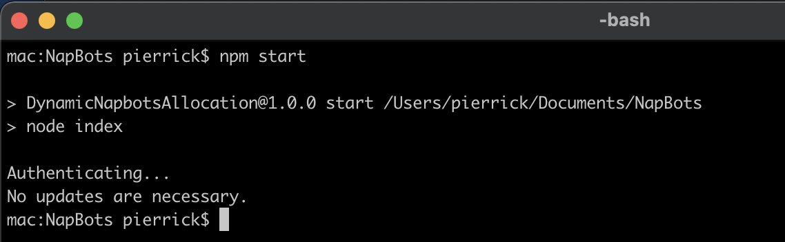

# Dynamic Napbots Allocation

Based on a [gist](https://gist.github.com/julienarcin/af2727307de2fd37d6a72973eafdbfc9) from [@julienarcin](https://gist.github.com/julienarcin).

This node.js app allocates napbots bots based on the current [weather condition](https://platform.napbots.com/crypto-weather).

## Requirements

- [git](https://git-scm.com/)
- [node.js](https://nodejs.org/en/)
- A [Napbots](https://platform.napbots.com/) account
- Your Napbots user id. Check [this link](https://imgur.com/a/fW4I8Be) to find out how to retrieve your user id
- Default compositions (which bots to use based on the weather condition) are in `index.js`

## Usage

- Clone this repository: `git clone https://github.com/PierrickI3/napbots`
- Set your credentials in environment variables. Use `set` (Windows) or `export` (Mac) to set them. E.g. to set the email environment on a Mac, run `export NAPBOTS_EMAIL=email@domain.com` or on Windows, run `set NAPBOTS_EMAIL=email@domain.com`
  - Email: `NAPBOTS_EMAIL=email@domain.com`
  - Password : `NAPBOTS_PASSWORD=mypassword`
  - User id: `NAPBOTS_USERID=xxxxxxxxxxxxx` (check above on how to get your user id)
- Run the app: `npm start`
- Wait until the app is done with either `Success!`, `No updates are necessary` or an error message if something bad happened.

## Adding more bots

- To add another bot in the composition, check [this image](https://imgur.com/a/ayit9pR) to find out how to retrieve a bot id
- Edit `index.js` and change the `compositions` object accordingly